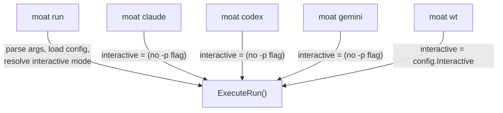
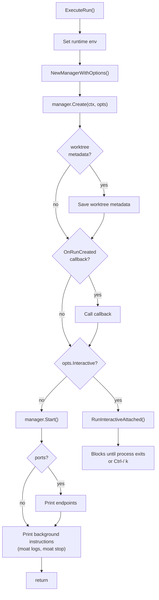
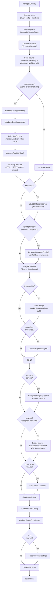
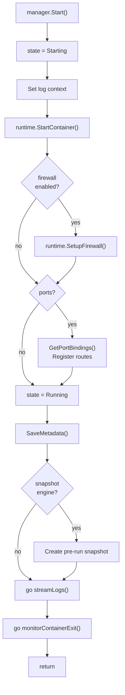
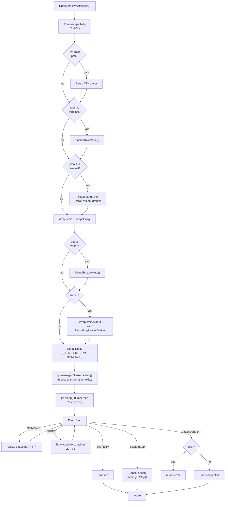
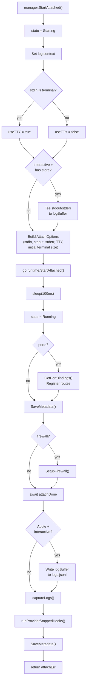
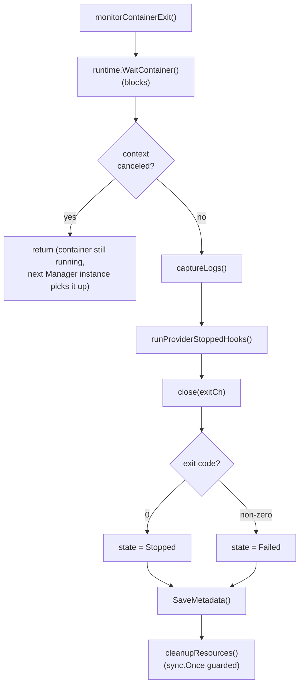

# Runtime Flow: Interactive vs Non-Interactive

Here's the summary:

  Created docs/runtime-flow.md with 7 mermaid diagrams tracing both paths from CLI entry through container lifecycle:

  1. Entry points → ExecuteRun()
  2. The interactive/non-interactive fork
  3. manager.Create() (shared heavyweight setup)
  4. Non-interactive: manager.Start() → background
  5. Interactive: RunInteractiveAttached() → event loop
  6. manager.StartAttached() internals
  7. monitorContainerExit() cleanup

  7 simplification opportunities identified, ranked by impact/effort:
  ┌──────────┬──────────────────────────────────────────────┬────────────────────────────────────────────────────────────────────────────┐
  │ Priority │                     What                     │                                    Why                                     │
  ├──────────┼──────────────────────────────────────────────┼────────────────────────────────────────────────────────────────────────────┤
  │ 1        │ Remove TTY field from ExecOptions            │ Always equals Interactive — dead weight                                    │
  ├──────────┼──────────────────────────────────────────────┼────────────────────────────────────────────────────────────────────────────┤
  │ 2        │ Remove streamLogs from non-interactive Start │ Users use moat logs -f now; goroutine lifecycle is unclear                 │
  ├──────────┼──────────────────────────────────────────────┼────────────────────────────────────────────────────────────────────────────┤
  │ 3        │ Extract postStart() helper                   │ Start() and StartAttached() share ~60% of code                             │
  ├──────────┼──────────────────────────────────────────────┼────────────────────────────────────────────────────────────────────────────┤
  │ 4        │ Simplify interactive event loop              │ Only one escape action now; the channel dance is overkill                  │
  ├──────────┼──────────────────────────────────────────────┼────────────────────────────────────────────────────────────────────────────┤
  │ 5        │ Extract idempotent cleanupRun()              │ Cleanup is duplicated across 3 paths with inconsistent guards              │
  ├──────────┼──────────────────────────────────────────────┼────────────────────────────────────────────────────────────────────────────┤
  │ 6        │ ProviderRunner helper                        │ claude/codex/gemini CLIs are ~200 lines each of near-identical boilerplate │
  ├──────────┼──────────────────────────────────────────────┼────────────────────────────────────────────────────────────────────────────┤
  │ 7        │ Skip: TTY trace builder                      │ Future-proofing, not needed now                                            │
  └──────────┴──────────────────────────────────────────────┴────────────────────────────────────────────────────────────────────────────┘
  Want me to proceed with any of these?

Current state after the attach/detach simplification.

## Entry Points

All commands converge on `ExecuteRun()`:

Each entry point builds an `ExecOptions` struct with `Interactive` and `TTY` set identically (both true or both false), then calls `ExecuteRun()`.

## ExecuteRun: The Fork

## manager.Create(): Shared Setup (Both Modes)

This is the heavyweight function (~500 lines). Both modes go through the same path.

## Non-Interactive Path: manager.Start()

After `Start()` returns, `ExecuteRun()` prints the background instructions and the CLI exits. The container runs independently. `monitorContainerExit()` runs in a background goroutine that captures logs, runs provider hooks, and cleans up when the container eventually exits.

## Interactive Path: RunInteractiveAttached()

## manager.StartAttached()

## Cleanup: monitorContainerExit()

Runs as a background goroutine for **non-interactive** runs (started by `manager.Start()`). For **interactive** runs, cleanup is done inline in `manager.StartAttached()`.

---

## Completed Simplifications

The following simplifications were identified during analysis and have been implemented:

### 1. Removed `TTY` field from ExecOptions ✅
`ExecOptions.TTY` was always set identically to `Interactive`. Removed the field — TTY is now determined at runtime via `term.IsTerminal(os.Stdin)` in `manager.StartAttached()`.

### 2. Removed `streamLogs` from non-interactive Start ✅
`StreamLogs` was never `true` in production. Non-interactive runs tell users to use `moat logs -f`. Removed the `streamLogs` method and its `stdcopy` import.

### 3. Extracted postStart helpers ✅
Extracted `setLogContext()`, `setupPortBindings()`, and `setupFirewall()` from the duplicated code in `Start()` and `StartAttached()`. Reduced ~80 lines of duplication.

### 4. Simplified interactive event loop ✅
With only one escape action (`EscapeStop`), eliminated the `escapeCh` channel. Escape errors now flow through `attachDone` and are handled inline. The attach goroutine is a one-liner.

### 5. Extracted idempotent `cleanupResources()` ✅
Consolidated resource cleanup from `Stop()`, `Wait()`, `monitorContainerExit()`, and `Destroy()` into a single method guarded by `sync.Once`. Reduced ~300 lines of duplicated cleanup code.

### 6. Extracted `ProviderRunner` helper ✅
`moat claude`, `moat codex`, and `moat gemini` now use a shared `RunProvider()` helper. Each provider is ~30-50 lines of declarative config instead of ~170 lines of boilerplate. Provider-specific logic is isolated in `BuildCommand` and `ConfigureAgent` callbacks.

### 7. TTY trace builder pattern — Skipped
The conditional wrapping is clear as-is. Not needed until more layers are added.

The duplication is significant (~200 lines each with minor variations).

**Opportunity:** Extract a `ProviderRunner` helper that takes a provider-specific config (dependencies, command builder, flag names) and handles the boilerplate. Each provider CLI becomes ~50 lines of config + flag registration.

### 7. Non-interactive Start() still streams logs to stdout

`manager.Start()` calls `go m.streamLogs()` which copies container logs to stdout. But `ExecuteRun()` returns immediately after Start() for non-interactive mode, and the manager is deferred-closed. The `streamLogs` goroutine's lifecycle is unclear — it may be killed when the manager closes.

**Opportunity:** Since non-interactive runs print "use moat logs -f", consider removing the `streamLogs` call entirely. The user explicitly monitors via `moat logs`. This simplifies the non-interactive path and eliminates the goroutine lifecycle question.

### Priority ranking

| # | Opportunity | Impact | Effort |
|---|------------|--------|--------|
| 5 | Remove `TTY` field (always = Interactive) | Low risk, cleaner API | Small |
| 7 | Remove streamLogs from non-interactive Start | Simpler lifecycle | Small |
| 1 | Extract postStart() helper | Less duplication in manager | Medium |
| 3 | Simplify interactive event loop | Fewer channels/goroutines | Medium |
| 2 | Idempotent cleanupRun() | Correctness + less duplication | Medium |
| 6 | ProviderRunner helper | Major dedup across 3 files | Large |
| 4 | TTY trace builder pattern | Future-proofing only | Skip |
